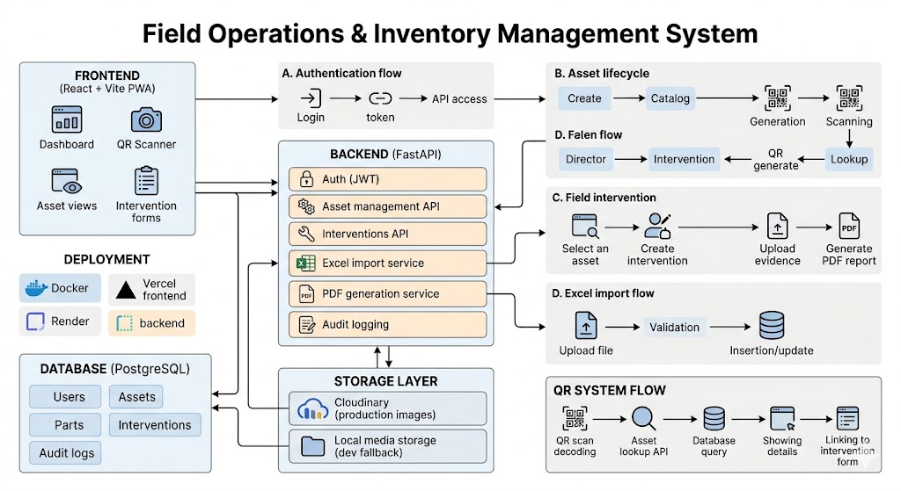

# Система управления выездными операциями и инвентарем



Полноценное full-stack веб-приложение для управления выездными работами, инвентарем оборудования, техническими вмешательствами, поиском активов по QR-коду, загрузкой доказательств и генерацией PDF-отчетов.

Проект задуман как универсальная операционная система, которую можно адаптировать для команд технического обслуживания, сервисных компаний, внутреннего учета активов, инспекционных процессов и выездной поддержки.

## Обзор

Приложение помогает командам вести структурированный учет физических активов и выездных работ.

Возможности системы:

- Управление инвентарем и активами.
- Сканирование активов по QR-коду.
- Отчеты о технических вмешательствах.
- Загрузка доказательств с проверкой изображений.
- Генерация PDF-отчетов.
- Импорт инвентаря из Excel.
- JWT-аутентификация с ролями пользователей.
- Аудит-логирование ключевых действий.
- Поддержка Progressive Web App для мобильного использования.

## Функции

- Аутентификация пользователей с JWT.
- Ролевой контроль доступа для пользователей `admin` и `technician`.
- Bootstrap-endpoint для создания первого администратора.
- Каталог активов с фильтрацией и пагинацией.
- Каталог запчастей/моделей.
- Генерация QR-кодов для активов.
- Поиск по QR / серийному номеру / внутреннему коду.
- Создание и отслеживание выездных вмешательств.
- Связь активов с вмешательствами.
- Загрузка изображений-доказательств.
- Поддержка Cloudinary для хранения изображений в production.
- Локальное хранение медиа как fallback для разработки.
- Генерация PDF-отчетов по вмешательствам.
- Импорт Excel для массовой загрузки инвентаря.
- Аудит-логирование входов, сканов, вмешательств, привязки активов и загрузки доказательств.
- Health check endpoint с проверкой базы данных.
- Middleware request ID для трассировки backend-запросов.
- React dashboard с защищенными маршрутами.
- Мобильная PWA-настройка с service worker и offline-страницей.

## Технологический стек

### Backend

- FastAPI
- SQLAlchemy
- PostgreSQL
- Alembic
- Pydantic
- JWT-style HMAC tokens
- ReportLab
- Pillow
- OpenPyXL
- Cloudinary
- Uvicorn

### Frontend

- React
- Vite
- React Router
- jsQR
- CSS
- Service Worker / PWA manifest

### Инфраструктура

- Docker
- Docker Compose
- Backend startup script, готовый для Render
- Конфигурация frontend для Vercel

## Структура проекта

```text
.
├── app/
│   ├── api/
│   │   ├── deps.py
│   │   ├── router.py
│   │   └── routes/
│   │       ├── auth.py
│   │       ├── assets.py
│   │       ├── import_excel.py
│   │       ├── interventions.py
│   │       └── parts.py
│   ├── core/
│   │   ├── config.py
│   │   ├── database.py
│   │   ├── logging.py
│   │   └── security.py
│   ├── models/
│   ├── schemas/
│   ├── scripts/
│   ├── services/
│   └── main.py
├── alembic/
├── public/
│   ├── manifest.webmanifest
│   ├── offline.html
│   └── sw.js
├── src/
│   ├── auth/
│   ├── components/
│   ├── pages/
│   ├── services/
│   ├── App.jsx
│   ├── main.jsx
│   └── registerServiceWorker.js
├── Dockerfile
├── docker-compose.yml
├── requirements.txt
├── package.json
├── start.sh
├── vercel.json
└── vite.config.js
```

## Основные рабочие процессы

### Аутентификация

Пользователи входят по email и паролю. Backend возвращает access token, который frontend использует для доступа к защищенным API-маршрутам.

Поддерживаемые роли:

- admin
- technician

Администраторы могут работать с административными сценариями, такими как создание активов, управление каталогом запчастей/моделей и импорт Excel. Техники могут использовать операционные сценарии, такие как поиск активов и оформление отчетов о вмешательствах.

### Управление активами

Система хранит физические активы с идентификационной информацией: серийный номер, внутренний код, ссылка на модель/запчасть, статус и местоположение.

Активы можно искать, фильтровать, просматривать и связывать с вмешательствами.

### QR-сканирование

Для каждого актива можно сгенерировать QR-код.

Endpoint сканирования может находить активы по:

- Внутреннему QR-формату.
- Серийному номеру.
- Внутреннему коду актива.

Frontend включает сканирование QR-кодов через камеру с использованием jsQR.

### Вмешательства

Пользователи могут создавать записи о вмешательствах с полевыми данными: тип, местоположение, техник, дата, описание, связанные активы и подтверждающие материалы.

### Загрузка доказательств

Доказательства по вмешательству можно загружать в виде изображений.

В production файлы изображений могут храниться в Cloudinary. В локальной разработке приложение может использовать локальное media-хранилище.

### PDF-отчеты

Вмешательства можно экспортировать в PDF-отчеты, включая структурированные данные вмешательства и доступные доказательства.

### Импорт Excel

Администраторы могут импортировать данные инвентаря из файлов .xlsx. Процесс импорта поддерживает валидацию, обработку ошибок на уровне строк и upsert-поведение для моделей/запчастей и активов.

### Аудит-логирование

Важные действия пользователей записываются в audit logs, включая аутентификацию, сканирование, создание вмешательств, привязку активов и загрузку доказательств.

## API

Backend предоставляет версионированный REST API по адресу:

/api/v1

Основные области API:

- /api/v1/auth
- /api/v1/parts
- /api/v1/assets
- /api/v1/interventions
- /api/v1/import

Интерактивная документация API:

/docs

Health check:

/health

## Локальная разработка

### Требования

- Docker
- Docker Compose
- Node.js
- npm

### Переменные окружения

Создайте файл .env в корне проекта.

Пример:

```env
DATABASE_URL=postgresql://asset_ops_user:asset_ops_pass@db:5432/asset_ops_db
AUTO_CREATE_TABLES=false
AUTH_SECRET_KEY=replace-this-with-a-secure-secret
ACCESS_TOKEN_EXP_MINUTES=720
AUTH_ISSUER=asset-operations-platform
MEDIA_DIR=/app/media
CLOUDINARY_URL=
```

Для production всегда задавайте надежный AUTH_SECRET_KEY.

### Запуск backend и базы данных

```bash
docker compose up -d --build
```

### Запуск миграций

```bash
docker compose exec api alembic upgrade head
```

### Проверка backend health

```bash
curl http://localhost:8000/health
```

### Открыть API Docs

```text
http://localhost:8000/docs
```

## Разработка frontend

Установить зависимости:

```bash
npm install
```

Запустить Vite development server:

```bash
npm run dev
```

Собрать production build:

```bash
npm run build
```

Предпросмотр production build:

```bash
npm run preview
```

## Миграции базы данных

Применить все миграции:

```bash
docker compose exec api alembic upgrade head
```

Проверить текущую миграцию:

```bash
docker compose exec api alembic current
```

Посмотреть историю миграций:

```bash
docker compose exec api alembic history
```

Создать новую автоматически сгенерированную миграцию:

```bash
docker compose exec api alembic revision --autogenerate -m "describe_change"
```

## Заметки по деплою

### Backend

Backend подготовлен для деплоя на платформах вроде Render.

Включенный startup script запускает миграции перед стартом API:

```bash
./start.sh
```

Эквивалентная команда:

```bash
alembic upgrade head && uvicorn app.main:app --host 0.0.0.0 --port $PORT
```

### Frontend

Frontend включает конфигурацию vercel.json для деплоя на Vercel с SPA rewrites.

Укажите URL backend API в Vercel через:

```env
VITE_API_URL=https://your-backend-url.example.com
```

## Заметки по безопасности

Перед публикацией или деплоем:

- Не коммитьте .env файлы.
- Используйте надежный production AUTH_SECRET_KEY.
- Проверьте настройки CORS для production-домена.
- Храните учетные данные базы данных вне репозитория.
- Не коммитьте сгенерированные файлы, такие как node_modules, build artifacts, локальные media-файлы, cache files или .DS_Store.
- Ротируйте любые учетные данные, которые когда-либо случайно попали в репозиторий.

## Примеры использования

- Отчетность выездного сервиса.
- Операции технического обслуживания.
- Технические инспекционные процессы.
- Отслеживание жизненного цикла оборудования.
- Внутренние системы учета активов.
- Документирование работ на основе доказательств.
- Операционная отчетность для распределенных команд.

## Лицензия

Добавьте лицензию перед публикацией репозитория.

Распространенные варианты:

- MIT для permissive open-source использования.
- Apache-2.0 для permissive использования с явными патентными условиями.
- GPL-3.0 для copyleft/open redistribution требований.

## Дополнительная заметка

Небольшая отдельная заметка: перед открытой публикацией стоит проверить `.env`, `node_modules`, `dist`, `out`, `__pycache__` и `.DS_Store`, потому что в этом репозитории некоторые из этих файлов/папок могут встречаться. Я ничего не менял в этой части, только отмечаю это на момент clone/rename.
